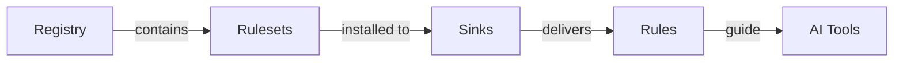

# AI Rules Manager (ARM)

## What is ARM?

A package manager for AI rules that treats rulesets like code dependencies - with semantic versioning, reproducible installs, and automatic distribution to your AI tools.

Connect to Git repositories like awesome-cursorrules or your team's rule collections, install versioned rulesets across projects, and keep them automatically synced with their source of truth.

## Why ARM?

AI coding assistants like Cursor and Amazon Q rely on rules to guide their behavior, but managing these rules is broken:

- **Manual copying** severs the connection to the source of truth - once copied, rules are orphaned with no way to get updates
- **Breaking changes blindness** - when you pull latest rules, you have no idea if they'll break your AI's behavior
- **Doesn't scale** - managing rules across even 3 projects becomes unmanageable overhead

ARM treats AI rules like code dependencies - versioned, distributable packages that stay in sync across your entire development environment.

## Installation

### Quick Install

```bash
curl -fsSL https://raw.githubusercontent.com/jomadu/ai-rules-manager/main/scripts/install.sh | bash
```

### Install Specific Version

```bash
curl -fsSL https://raw.githubusercontent.com/jomadu/ai-rules-manager/main/scripts/install.sh | bash -s v1.0.0
```

### Manual Installation

1. Download the latest release from [GitHub](https://github.com/jomadu/ai-rules-manager/releases)
2. Extract and move the binary to your PATH
3. Run `arm help` to verify installation

### Verify Installation

After installation, verify ARM is working:

```bash
arm version
arm help
```

## Quick Start

```bash
# Create a new project directory
mkdir my-ai-project && cd my-ai-project

# Configure the registry
arm config registry add awesome-cursorrules https://github.com/PatrickJS/awesome-cursorrules --type git

# Add Cursor sink
arm config sink add cursor --directories .cursor/rules --include "awesome-cursorrules/python"

# Install Python rules (defaults to latest - biases towards tags, falls back to main/master)
arm install awesome-cursorrules/python --include "rules-new/python.mdc"

# View your configuration
arm config list
# Registries:
#   awesome-cursorrules: https://github.com/PatrickJS/awesome-cursorrules (git)
#
# Sinks:
#   cursor:
#     directories: [.cursor/rules]
#     include: [awesome-cursorrules/python]
#     exclude: []
#     layout: hierarchical

# View installed rulesets
arm list
# awesome-cursorrules/python@c78546c (latest)
```

## Concepts

ARM has four core concepts:

1. **Rules** - Text files that guide AI tool behavior
2. **Rulesets** - Collections of rules that can be installed
3. **Registries** - Remote sources of versioned rulesets
4. **Sinks** - Local destinations for AI tool directories



## Files

- `arm.json` - Project-specific configuration with registries, dependencies, and sinks
- `arm-lock.json` - Project-specific locked versions for reproducible installs
- `arm-index.json` - Local flat layout index (maps hashes to original file paths)

### Rules

AI rules are text files that provide instructions, guidelines, and context to AI coding assistants. These files help AI tools understand your project's coding standards, architectural patterns, and specific requirements.

Different AI tools use different rule formats and locations:

**Cursor**: Uses `.cursorrules` files in project root or global "Rules for AI" settings. Rules are written in natural language and apply to Chat and Cmd+K features.

**GitHub Copilot**: Uses `.github/copilot-instructions.md` or files in `.github/instructions/` directory. Instructions are markdown files with specific formatting for customizing Copilot's behavior.

**Amazon Q**: Uses `.amazonq/rules/` directory with markdown files. Rules guide Q's code generation and chat responses within the IDE.

**Common Rule Types**:

- **Coding Standards**: Formatting, naming conventions, code organization
- **Architecture Guidelines**: Design patterns, project structure, technology choices
- **Domain Knowledge**: Business logic, API usage, framework-specific practices
- **Quality Requirements**: Testing approaches, security considerations, performance guidelines

ARM manages these rules as versioned packages, ensuring consistency across projects and teams while respecting each tool's specific format requirements.

### Rulesets

A ruleset is a collection of related AI rules, identified by names like `awesome-cursorrules/python` where `awesome-cursorrules` is the registry name and `python` is the ruleset name. Each ruleset contains rule files (markdown, text, etc.) with semantic versioning for predictable updates.

Rulesets are sourced from registries (remote repositories) and installed to sinks (local directories) where your AI tools can find them.

To install a ruleset, use `arm install <ruleset>[@version]` where:

- `<ruleset>` is the registry/ruleset name (e.g., "awesome-cursorrules/python")
- `[@version]` (optional) specifies the version constraint (defaults to "@latest" if omitted, e.g., "@main", "@1.2.0", "@^1.0.0")
- `--include <pattern>` (optional) filters which files to install using file patterns (defaults to `"**/*"`)

Ruleset installations are tracked in `arm.json` in your project root. This project-specific configuration file should be checked into version control, ensuring all contributors use the same rule versions and can reproduce the exact AI behavior.

**Key Commands:**

- `arm install <ruleset>[@version]` - Install a ruleset
- `arm update [ruleset]` - Update rulesets to latest compatible versions
- `arm uninstall <ruleset>` - Remove a ruleset
- `arm list` - Show installed rulesets
- `arm info [ruleset]` - Show detailed ruleset information

### Registries

Registries provide a version controlled source of truth for shared rulesets. Without them, teams would copy rules manually, losing connection to updates and creating inconsistent rule versions across projects.

A registry is a remote source containing rulesets, similar to how npm registries contain JavaScript packages. Registries can be implemented in many ways (S3, HTTP, etc.), but ARM currently supports Git-based registries. Examples include the popular awesome-cursorrules repository or your team's private rule collections.

To configure a registry connection, use `arm config registry add <name> <url> --type git` where:

- `<name>` is your chosen alias (e.g., "awesome-cursorrules")
- `<url>` is the Git repository URL (e.g., "https://github.com/PatrickJS/awesome-cursorrules")
- `--type git` specifies this is a Git-based registry

Registry configurations are stored in `arm.json` in your project root. This project-specific configuration file should be checked into version control, ensuring consistent rule sources across all contributors to the project.

**Key Commands:**

- `arm config registry add <name> <url> --type git` - Add a new registry
- `arm config registry list` - List configured registries
- `arm config registry remove <name>` - Remove a registry

### Sinks

A sink defines where installed rulesets should be placed in your local filesystem and in what layout, targeting specific directories where AI tools look for rules.

To configure a sink, use `arm config sink add <name> --directories <dir>` where:

- `<name>` is your chosen alias (e.g., "cursor")
- `<dir>` is the target directory (e.g., ".cursor/rules")
- `--layout <flat|hierarchical>` (optional) layout mode, hierarchical (default) preserves directory structure, flat places files in a single directory with hash-prefixed names
- `--include <pattern>` (optional) filters which rulesets to sink using file patterns (defaults to `"**/*"`)

Sink configurations are stored in `arm.json` in your project root. This project-specific configuration file should be checked into version control, ensuring all contributors use the same AI tool setup.

**Key Commands:**

- `arm config sink add <name> --directories <dir>` - Add a new sink
- `arm config sink add <name> --directories <dir> --layout flat` - Add sink with flat layout
- `arm config sink add <name> --directories <dir> --include <pattern>` - Add sink with include patterns
- `arm config sink list` - List configured sinks
- `arm config sink remove <name>` - Remove a sink

#### Layout Modes

**Choose Your Layout:**

| AI Tool        | Recommended Layout | Reason                                             |
| -------------- | ------------------ | -------------------------------------------------- |
| Cursor         | Hierarchical       | Supports nested directory structures               |
| GitHub Copilot | Flat               | Expects files in `.github/instructions/` directory |
| Amazon Q       | Hierarchical       | Works with `.amazonq/rules/` directory structure   |

**Hierarchical Layout (Default)**

Preserves the original directory structure from rulesets. Files are organized as `sink-dir/arm/registry/ruleset/version/original-path`:

```
.cursor/rules/
└── arm/
    └── ai-rules/
        └── rules/
            └── 1.0.0/
                └── rules/
                    ├── grug-brained-dev.md
                    └── clean-code.md
```

**Flat Layout**

Places all files in a single directory with hash-prefixed names. Each filename starts with an 8-character hash (derived from registry/ruleset@version:filepath) followed by the original path with slashes replaced by underscores:

```
.github/copilot/
├── arm_183791a9_rules_clean-code.md
├── arm_3554667c_rules_grug-brained-dev.md
└── arm-index.json
```

The `arm-index.json` file maps hashed filenames back to their original paths:

```json
{
  "arm_183791a9_rules_clean-code.md": {
    "registry": "ai-rules",
    "ruleset": "rules",
    "version": "1.0.0",
    "filePath": "rules/clean-code.md"
  },
  "arm_3554667c_rules_grug-brained-dev.md": {
    "registry": "ai-rules",
    "ruleset": "rules",
    "version": "1.0.0",
    "filePath": "rules/grug-brained-dev.md"
  }
}
```

Configure via CLI:

```bash
arm config sink add copilot --directories .github/copilot --layout flat
```

Sinks are stored in `arm.json`:

```json
{
  "registries": { ... },
  "rulesets": { ... },
  "sinks": {
    "cursor": {
      "directories": [".cursor/rules"],
      "layout": "hierarchical"
    },
    "copilot": {
      "directories": [".github/copilot"],
      "layout": "flat"
    }
  }
}
```
