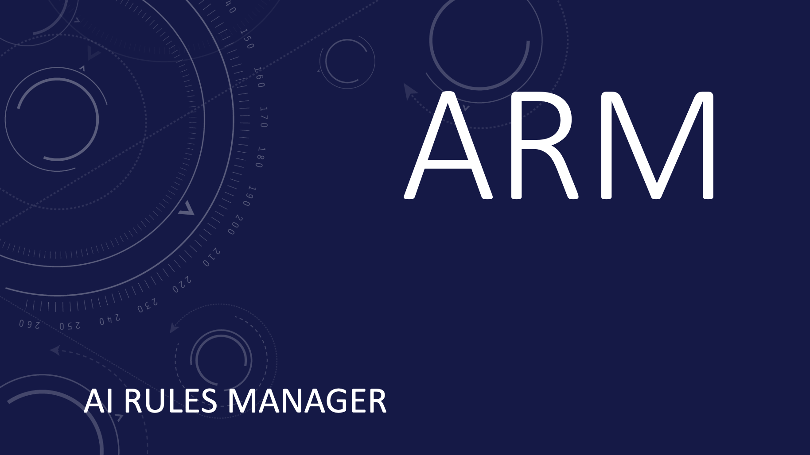

# AI Rules Manager (ARM)

## What is ARM?

A package manager for AI rules that treats rulesets like code dependencies - with semantic versioning, reproducible installs, and automatic distribution to your AI tools.

Connect to Git repositories like awesome-cursorrules or your team's rule collections, install versioned rulesets across projects, and keep them automatically synced with their source of truth.

## Why ARM?

AI coding assistants like Cursor and Amazon Q rely on rules to guide their behavior, but managing these rules is broken:

- **Manual copying** severs the connection to the source of truth - once copied, rules are orphaned with no way to get updates
- **Breaking changes blindness** - when you pull latest rules, you have no idea if they'll break your AI's behavior
- **Doesn't scale** - managing rules across even 3 projects becomes unmanageable overhead
- **Format fragmentation** - each AI tool uses different rule formats, requiring manual conversion

ARM solves the first three problems with a **package manager approach** - semantic versioning, reproducible installs, and automatic distribution keep rules connected to their source of truth. The fourth problem is solved with **Universal Rule Format (URF)** - write rules once in a tool-agnostic format, then automatically compile them for any AI tool.

## Installation

### Quick Install

```bash
curl -fsSL https://raw.githubusercontent.com/jomadu/ai-rules-manager/main/scripts/install.sh | bash
```

### Install Specific Version

```bash
curl -fsSL https://raw.githubusercontent.com/jomadu/ai-rules-manager/main/scripts/install.sh | bash -s v1.0.0
```

### Manual Installation

1. Download the latest release from [GitHub](https://github.com/jomadu/ai-rules-manager/releases)
2. Extract and move the binary to your PATH
3. Run `arm help` to verify installation

### Verify Installation

```bash
arm version
arm help
```

> **Upgrading from v2?** See the [migration guide](docs/migration-v2-to-v3.md) for breaking changes and upgrade steps.

## Uninstall

```bash
curl -fsSL https://raw.githubusercontent.com/jomadu/ai-rules-manager/main/scripts/uninstall.sh | bash
```

## Quick Start

Add Git registry:
```bash
arm config registry add ai-rules https://github.com/jomadu/ai-rules-manager-sample-git-registry --type git
```

Add GitLab registry:
```bash
arm config registry add my-gitlab https://gitlab.example.com --type gitlab --project-id 123 --api-version v4
```

Add Cloudsmith registry:
```bash
arm config registry add my-cloudsmith https://app.cloudsmith.com/myorg/ai-rules --type cloudsmith
```

Configure sinks:

**Cursor:**
```bash
arm config sink add cursor .cursor/rules --type cursor
```

**GitHub Copilot:**
```bash
arm config sink add copilot .github/copilot --type copilot
```

**Amazon Q:**
```bash
arm config sink add q .amazonq/rules --type amazonq
```

Install ruleset:
```bash
arm install ai-rules/rules --include "**/*.cursorrules" --sinks cursor
```

Install URF ruleset to single sink:
```bash
arm install ai-rules/grug-brained-dev --include "rulesets/grug-brained-dev.yml" --sinks cursor
```

Install URF ruleset to multiple sinks:
```bash
arm install ai-rules/grug-brained-dev --include "rulesets/grug-brained-dev.yml" --sinks cursor,copilot,q
```

## Concepts

### Files

ARM uses four key files to manage your AI rules:

- **`arm.json`** - Team-shared project manifest with registries, rulesets, and sinks
- **`arm-lock.json`** - Team-shared locked versions for reproducible installs
- **`arm-index.json`** - Local sink inventory tracking what ARM has installed in that sink, used to generate the `arm_index.*` file
- **`arm_index.*`** - Generated priority rule that helps AI tools resolve conflicts between rulesets

### Rules

AI rules are text files that provide instructions, guidelines, and context to AI coding assistants. Different AI tools use different formats:

- **Cursor**: `.cursorrules` files or `.mdc` files with YAML frontmatter
- **Amazon Q**: `.md` files in `.amazonq/rules/` directory
- **GitHub Copilot**: `.instructions.md` files in `.github/copilot/` directory

ARM manages these rules as versioned packages, ensuring consistency across projects while respecting each tool's format requirements.

### Rulesets

Rulesets are collections of AI rules packaged as versioned units, identified by names like `ai-rules/cursor-rules` where `ai-rules` is the registry and `cursor-rules` is the ruleset name.

**Key Commands:**
- `arm install <ruleset>[@version] --sinks <sinks> [--priority <number>]` - Install ruleset to specific sinks
- `arm update [ruleset]` - Update to latest compatible versions
- `arm uninstall <ruleset>` - Remove ruleset
- `arm list` - Show installed rulesets
- `arm info [ruleset]` - Show detailed information
- `arm config ruleset update <ruleset> <key> <value>` - Update ruleset configuration

#### Universal Rule Format (URF)

URF enables tool-agnostic rule authoring. Write rules once in YAML format, then automatically compile them for any AI tool:

```yaml
version: "1.0"
metadata:
  id: "grug-brained-dev"
  name: "Grug-Brained Developer Rules"
  version: "1.0.0"
rules:
  simple-code:  # Rule ID as map key
    name: "Keep Code Simple"
    priority: 100
    enforcement: "must"
    body: |
      Write simple, obvious code that grug brain can understand.
      Avoid clever tricks and complex abstractions.
```

URF rulesets compile to tool-specific formats with embedded metadata for priority resolution and conflict management.

For detailed information about URF syntax, compilation process, and best practices, see the [Universal Rule Format documentation](docs/universal-rule-format.md).

### Registries

Registries are remote sources where rulesets are stored and versioned, similar to npm registries. ARM supports:

- **Git registries**: GitHub repositories, GitLab projects, or any Git remote
- **GitLab Package registries**: GitLab's Generic Package Registry for versioned rule packages
- **Cloudsmith registries**: Cloudsmith's package repository service for single-file artifacts

#### Registry Structure

**Recommended structure:**
```
clean-code.yml              # URF ruleset definitions
security.yml
performance.yml
build/                      # Pre-compiled rules
├── cursor/
│   ├── clean-code.mdc
│   └── security.mdc
└── amazonq/
    ├── clean-code.md
    └── security.md
```

This structure works for both Git repositories and GitLab packages, with URF files at the root level and pre-compiled rules organized under `build/` by AI tool. ARM defaults to installing URF files (`*.yml, *.yaml`) when no `--include` patterns are specified, making URF the primary workflow while keeping pre-compiled rules available via explicit patterns like `--include "build/cursor/**"`.

#### Archive Support

ARM automatically extracts and processes **zip** and **tar.gz** archives during installation:

- **Supported formats**: `.zip` and `.tar.gz` files
- **Automatic extraction**: Archives are detected by extension and extracted transparently
- **Merge behavior**: Extracted files are merged with loose files, with archives taking precedence in case of path conflicts
- **Security**: Path sanitization prevents directory traversal attacks
- **Pattern filtering**: `--include` patterns are applied to the merged content after extraction

**Example with archives:**
```
Repository contents:
├── rules.tar.gz           # Contains: security.yml, build/cursor/security.mdc
├── clean-code.yml         # Loose URF file
└── build/cursor/clean-code.mdc  # Loose pre-compiled file
```

Installing with `arm install registry/rules --include "**/*.yml"` will extract the archive and install both `security.yml` (from archive) and `clean-code.yml` (loose file).

**Examples:**
- [PatrickJS/awesome-cursorrules](https://github.com/PatrickJS/awesome-cursorrules) - Community collection of Cursor rules
- [snarktank/ai-dev-tasks](https://github.com/snarktank/ai-dev-tasks) - AI development task templates
- [steipete/agent-rules](https://github.com/steipete/agent-rules) - Agent configuration rules

**Key Commands:**
- `arm config registry add <name> <url> --type git` - Add Git registry
- `arm config registry add <name> <url> --type gitlab --project-id <id>` - Add GitLab registry
- `arm config registry add <name> <url> --type cloudsmith` - Add Cloudsmith registry
- `arm config registry list` - List registries
- `arm config registry remove <name>` - Remove registry

### Sinks

Sinks define where installed rules should be placed in your local filesystem. Each sink targets a specific directory for a particular AI tool.

**Key Commands:**
- `arm config sink add <name> <directory> --type <tool>` - Add sink
  - Supported types: `cursor`, `amazonq`, `copilot`
- `arm config sink list` - List sinks
- `arm config sink remove <name>` - Remove sink

#### Layout Modes

**Hierarchical Layout** (default): Preserves directory structure from rulesets
```
.cursor/rules/
└── arm/
    ├── ai-rules/
    │   └── rules/
    │       └── 1.0.0/
    │           └── rules/
    │               └── clean-code.mdc
    ├── arm_index.mdc
    └── arm-index.json
```

**Flat Layout**: Places all files in single directory with hash-prefixed names
```
.github/copilot/
├── 183791a9_rules_clean-code.instructions.md
├── arm_index.instructions.md
└── arm-index.json
```

#### Compilation of URF

URF rulesets are automatically compiled to tool-specific formats:

- **Cursor**: Markdown with YAML frontmatter (`.mdc`)
- **Amazon Q**: Pure markdown (`.md`)
- **Copilot**: Instructions format (`.instructions.md`)

Each compiled rule includes embedded metadata for priority resolution and ruleset tracking.
