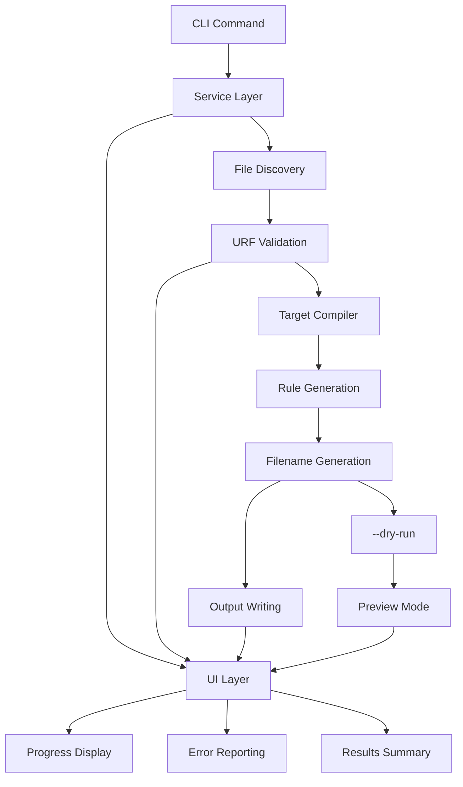

# ARM Compile Command Design

## Overview

This document outlines the design for a new `compile` command in ARM (AI Rules Manager) that enables standalone compilation of Universal Rule Format (URF) files to various AI tool formats without requiring installation to configured sinks.

## Background

ARM currently compiles URF files during the installation process, converting them to target-specific formats (Cursor, Amazon Q, GitHub Copilot, etc.) and placing them in configured sinks. While this works well for deployed rules, it doesn't support:

- Standalone rule development and testing
- CI/CD pipeline integration for rule validation
- Cross-tool rule development workflows
- Rule compilation without sink configuration

## Goals

1. **Enable standalone compilation** of URF files to any supported target format
2. **Reuse existing URF infrastructure** to maintain consistency and reduce code duplication
3. **Support batch compilation** for multiple files and directories
4. **Provide flexible output options** for different workflows
5. **Maintain compatibility** with existing ARM compilation behavior

## Command Interface

### Basic Syntax

```bash
arm compile [file...] [flags]
```

### Feature Flags

| Flag | Short | Type | Default | Description |
|------|-------|------|---------|-------------|
| `--target` | `-t` | string | *required* | Target format (cursor, amazonq, markdown, copilot) - supports comma-separated for multiple targets |
| `--output` | `-o` | string | `.` | Output directory (defaults to current directory) |
| `--namespace` | `-n` | string | *filename* | Optional namespace for compiled rules (defaults to filename) |
| `--force` | `-f` | bool | `false` | Overwrite existing files |
| `--recursive` | `-r` | bool | `false` | Recursively find URF files in directories (otherwise top-level only) |
| `--dry-run` | | bool | `false` | Show what would be compiled without writing files |
| `--verbose` | `-v` | bool | `false` | Show detailed compilation information and filtering |
| `--validate-only` | | bool | `false` | Validate URF syntax without compilation |
| `--include` | | []string | `[]` | Include patterns for file filtering (with --verbose for details) |
| `--exclude` | | []string | `[]` | Exclude patterns for file filtering (with --verbose for details) |
| `--fail-fast` | | bool | `false` | Stop compilation on first error |

### Usage Examples

```bash
# Compile single file to Cursor format (output to current directory)
arm compile code_quality.yaml --target cursor

# Compile to specific output directory
arm compile code_quality.yaml --target cursor --output .cursor/rules

# Multi-target compilation (creates target subdirectories)
arm compile rules.yaml --target cursor,amazonq,copilot --output ./compiled

# Compile multiple YAML files
arm compile rules/*.yml --target amazonq --output .amazonq/rules

# Compile all URF files in directory recursively
arm compile ./rulesets/ --target copilot --recursive --output .github/instructions

# Dry run to see what would be generated
arm compile rules.yaml --target cursor --dry-run --verbose

# Custom namespace for team rules
arm compile team_rules.yml --target markdown --namespace "team/standards"

# Validate URF files without compilation
arm compile *.yaml --validate-only

# Compile with filtering and verbose output
arm compile ./rules/ --target cursor --recursive --include "**/*quality*" --exclude "**/draft/**" --verbose

# Stop on first error (useful for CI)
arm compile ./rules/ --target cursor --recursive --fail-fast
```

## Architecture

### Current ARM Architecture

ARM uses a layered architecture with UI abstraction:

```
ARM Architecture
├── CLI Commands (cmd/arm/)
│   ├── Flag parsing
│   ├── Request creation
│   └── Service delegation
├── Service Layer (internal/arm/)
│   ├── Business logic
│   ├── UI coordination
│   └── Domain orchestration
├── UI Layer (internal/ui/)
│   ├── Progress reporting
│   ├── Error handling
│   └── Output formatting
└── Core Packages
    ├── URF (internal/urf/)
    ├── Types (internal/types/)
    └── Domain packages
```

### URF Infrastructure

ARM has comprehensive URF compilation infrastructure:

```
URF Infrastructure
├── Parser (urf.Parser)
├── Compiler (urf.Compiler)
├── Rule Generators
│   ├── CursorRuleGenerator
│   ├── MarkdownRuleGenerator
│   ├── CopilotRuleGenerator
│   └── (extensible)
└── Filename Generators
    ├── CursorFilenameGenerator
    ├── MarkdownFilenameGenerator
    ├── CopilotFilenameGenerator
    └── (extensible)
```

### Compilation Flow



### Current ARM Architecture

ARM now uses a layered architecture with clear separation of concerns:

```
CLI Layer (cmd/arm/)
├── Command parsing and validation
├── Flag handling
└── Service delegation

Service Layer (internal/arm/)
├── Business logic orchestration
├── Request/response handling
└── UI abstraction

UI Layer (internal/ui/)
├── Progress reporting
├── Error display
└── Results formatting

Core Packages
├── URF (internal/urf/): Compilation engine
├── Types (internal/types/): Shared data structures
└── Other domain packages
```

### Integration Points

The compile command integrates with existing ARM architecture:

1. **UI Package** (`internal/ui/`): Uses established UI interface for consistent output
2. **Service Layer** (`internal/arm/`): Follows existing service patterns with request/response types
3. **URF Package** (`internal/urf/`): Reuses existing parsers, compilers, and generators
4. **Command Layer** (`cmd/arm/`): Follows established cobra command patterns

## Architectural Changes Since Original Design

Since this design was written, ARM has evolved to use a more structured architecture:

### Key Changes

1. **UI Abstraction Layer**: All user interaction now goes through `internal/ui/ui.go` which provides a consistent interface for progress reporting, error handling, and output formatting.

2. **Service Layer Pattern**: Commands delegate to `internal/arm/service.go` which orchestrates business logic and coordinates with the UI layer.

3. **Request/Response Types**: Commands create request structs (like `InstallRequest`) and pass them to service methods, following a consistent pattern.

4. **Simplified Command Structure**: Commands focus on flag parsing and request creation, with all business logic in the service layer.

### Impact on Compile Command

These changes simplify the compile command implementation:

- **No direct UI calls** in command code - all output goes through the service layer
- **Consistent error handling** via the UI interface
- **Reusable patterns** from existing commands like install/uninstall
- **Clean separation** between CLI concerns and business logic

## Implementation Plan

### 1. Command Registration (`cmd/arm/main.go`)

```go
func init() {
    rootCmd.AddCommand(newInstallCmd())
    rootCmd.AddCommand(newUninstallCmd())
    rootCmd.AddCommand(newUpdateCmd())
    rootCmd.AddCommand(newOutdatedCmd())
    rootCmd.AddCommand(newListCmd())
    rootCmd.AddCommand(newInfoCmd())
    rootCmd.AddCommand(newConfigCmd())
    rootCmd.AddCommand(newCacheCmd())
    rootCmd.AddCommand(newCompileCmd()) // Add compile command
    rootCmd.AddCommand(newVersionCmd())
}
```

### 2. Command Structure (`cmd/arm/compile.go`)

```go
func newCompileCmd() *cobra.Command {
    cmd := &cobra.Command{
        Use:   "compile [file...]",
        Short: "Compile URF files to target format",
        Long:  `Compile Universal Rule Format (URF) files to specific AI tool formats.`,
        RunE:  runCompile,
        Args:  cobra.MinimumNArgs(1),
    }

    cmd.Flags().StringP("target", "t", "", "Target format (cursor, amazonq, markdown, copilot) - supports comma-separated")
    cmd.Flags().StringP("output", "o", ".", "Output directory")
    cmd.Flags().StringP("namespace", "n", "", "Optional namespace for compiled rules")
    cmd.Flags().BoolP("force", "f", false, "Overwrite existing files")
    cmd.Flags().BoolP("recursive", "r", false, "Recursively find URF files in directories")
    cmd.Flags().Bool("dry-run", false, "Show what would be compiled without writing files")
    cmd.Flags().BoolP("verbose", "v", false, "Show detailed compilation information")
    cmd.Flags().Bool("validate-only", false, "Validate URF syntax without compilation")
    cmd.Flags().StringSlice("include", nil, "Include patterns for file filtering")
    cmd.Flags().StringSlice("exclude", nil, "Exclude patterns for file filtering")
    cmd.Flags().Bool("fail-fast", false, "Stop compilation on first error")

    cmd.MarkFlagRequired("target")
    return cmd
}

func runCompile(cmd *cobra.Command, args []string) error {
    ctx := context.Background()

    // Parse flags
    target, _ := cmd.Flags().GetString("target")
    outputDir, _ := cmd.Flags().GetString("output")
    namespace, _ := cmd.Flags().GetString("namespace")
    force, _ := cmd.Flags().GetBool("force")
    recursive, _ := cmd.Flags().GetBool("recursive")
    dryRun, _ := cmd.Flags().GetBool("dry-run")
    verbose, _ := cmd.Flags().GetBool("verbose")
    validateOnly, _ := cmd.Flags().GetBool("validate-only")
    include, _ := cmd.Flags().GetStringSlice("include")
    exclude, _ := cmd.Flags().GetStringSlice("exclude")
    failFast, _ := cmd.Flags().GetBool("fail-fast")

    // Create compile request
    req := &arm.CompileRequest{
        Files:        args,
        Target:       target,
        OutputDir:    outputDir,
        Namespace:    namespace,
        Force:        force,
        Recursive:    recursive,
        DryRun:       dryRun,
        Verbose:      verbose,
        ValidateOnly: validateOnly,
        Include:      include,
        Exclude:      exclude,
        FailFast:     failFast,
    }

    // Execute compilation
    return armService.CompileFiles(ctx, req)
}
```

### 2. Service Interface Extension (`internal/arm/service_interface.go`)

```go
// Add to Service interface
type Service interface {
    // ... existing methods ...
    CompileFiles(ctx context.Context, req *CompileRequest) error
}
```

### 3. Types Extension (`internal/arm/types.go`)

```go
// CompileRequest groups compile parameters following ARM patterns
type CompileRequest struct {
    Files        []string
    Targets      []string
    OutputDir    string
    Namespace    string
    Force        bool
    Recursive    bool
    DryRun       bool
    Verbose      bool
    ValidateOnly bool
    Include      []string
    Exclude      []string
    FailFast     bool
}
```

### 4. Service Implementation (`internal/arm/service_compile.go`)

```go
func (a *ArmService) CompileFiles(ctx context.Context, req *CompileRequest) error {
    // 1. Discover files
    files, err := a.discoverFiles(req.Files, req.Recursive, req.Include, req.Exclude)
    if err != nil {
        return err
    }

    // 2. Use targets directly from request
    targets := req.Targets

    // 3. Process each file
    var errors []error
    stats := CompileStats{}

    for _, file := range files {
        stats.FilesProcessed++

        if req.ValidateOnly {
            if err := a.validateURFFile(file); err != nil {
                a.ui.Error(fmt.Errorf("validation failed for %s: %w", file, err))
                errors = append(errors, err)
                if req.FailFast {
                    return err
                }
                continue
            }
            a.ui.Success(fmt.Sprintf("✓ %s validated", file))
        } else {
            compiled, err := a.compileFile(file, targets, req)
            if err != nil {
                a.ui.Error(fmt.Errorf("compilation failed for %s: %w", file, err))
                errors = append(errors, err)
                stats.Errors++
                if req.FailFast {
                    return err
                }
                continue
            }
            stats.FilesCompiled++
            stats.RulesGenerated += compiled
        }
    }

    // 4. Display results
    a.displayCompileResults(stats, errors, req.ValidateOnly)

    if len(errors) > 0 {
        return fmt.Errorf("compilation completed with %d errors", len(errors))
    }

    return nil
}
```

### 5. UI Extension (`internal/ui/ui.go`)

```go
// Add to Interface
type Interface interface {
    // ... existing methods ...
    CompileStep(step string)
    CompileComplete(stats CompileStats, validateOnly bool)
}

// Add to UI implementation
func (u *UI) CompileStep(step string) {
    pterm.Info.Printf("%s ✓\n", step)
}

func (u *UI) CompileComplete(stats CompileStats, validateOnly bool) {
    if validateOnly {
        pterm.Success.Printf("Validated %d files\n", stats.FilesProcessed)
    } else {
        pterm.Success.Printf("Compiled %d files, generated %d rules\n",
            stats.FilesCompiled, stats.RulesGenerated)
    }
}
```

## Design Decisions

### File Discovery

**Question**: How should file discovery work for directories?

**Decision**:
- Without `--recursive`: Only process files directly in the specified directory (top-level only)
- With `--recursive`: Process all URF files in directory tree
- Support shell glob patterns in file arguments
- Restrict to YAML files only (`.yaml`, `.yml` extensions)

### Namespace Generation

**Question**: How should namespaces be derived when not specified?

**Decision**: Simple default approach:
1. Explicit `--namespace` flag when provided
2. Default to filename without extension: `rules.yaml` → `rules`
3. Keep it simple - no version suffixes or complex path derivation needed

### Output Structure

**Question**: Should output maintain source directory structure?

**Decision**:
- **Flatten output**: All compiled files go directly in output directory
- **Multi-target subdirectories**: For `--target cursor,amazonq`, create `{output-dir}/cursor/` and `{output-dir}/amazonq/` subdirectories
- **Simple and predictable**: Easy to find compiled files, works well with AI tool expectations

### Error Handling

**Question**: How should batch compilation errors be handled?

**Decision**:
- **Continue processing** valid files by default
- **Collect and report** all errors at the end with same detail level as other ARM commands
- **Exit codes**: 0=success, 1=some failures, 2=all failures
- **`--fail-fast` flag**: Stop on first error (useful for CI pipelines)

### Metadata Compatibility

**Question**: Should compiled files include ARM metadata?

**Decision**: **Simplified approach for standalone compilation**:
- ARM metadata headers not necessary for standalone `compile` command
- Keep compiled files clean and tool-focused
- Maintain compatibility with URF format but don't require full ARM installation metadata

## Benefits

### For Developers
- **Rapid iteration**: Compile and test rules without installing
- **Multi-tool development**: Easily generate rules for different AI tools
- **Validation workflows**: Check URF syntax and compilation before deployment

### For CI/CD
- **Rule validation**: Automated testing of rule compilation
- **Cross-tool compatibility**: Verify rules work across multiple AI tools
- **Quality gates**: Prevent broken rules from being deployed

### For Teams
- **Standardized workflows**: Consistent rule development across team members
- **Tool flexibility**: Switch between AI tools while maintaining same rules
- **Testing integration**: Easy integration with existing test frameworks

## Backwards Compatibility

- **No changes** to existing installation or compilation behavior
- **Reuses existing infrastructure** without modification
- **Maintains compatibility** between install-compiled and standalone-compiled files
- **Preserves all current** URF features and capabilities

## Future Enhancements

### Phase 2 Features
- **Watch mode**: `--watch` for continuous compilation during development (monitors files and recompiles on changes)
- **Template support**: Custom rule templates and generators
- **Integration hooks**: Pre/post compilation scripts
- **Advanced validation**: Semantic rule validation beyond syntax checking

### Phase 3 Features
- **Rule bundling**: Combine multiple URF files into single outputs
- **Dependency resolution**: Handle cross-rule dependencies
- **Performance optimization**: Parallel compilation for large rulesets
- **Advanced output formats**: Custom generators and format extensions

## Testing Strategy

### Unit Tests
- File discovery with various patterns
- URF validation and error handling
- Compilation output verification
- Namespace generation logic

### Integration Tests
- End-to-end compilation workflows
- Multi-file batch processing
- Error handling and recovery
- Output format validation

### Compatibility Tests
- Compare install vs compile output
- Cross-tool compilation verification
- Metadata consistency validation

## Decisions Made

Based on user feedback, the following decisions have been finalized:

### Core Decisions ✅
1. **File Discovery**: Use shell glob patterns, YAML files only (`.yaml`, `.yml`)
2. **Directory Behavior**: Top-level only without `--recursive` flag
3. **Output Structure**: Flatten output with target subdirectories for multi-target compilation
4. **Namespace**: Simple default (filename without extension), optional explicit namespace
5. **Error Handling**: Continue processing, collect errors, match ARM error detail level
6. **Output Default**: Current directory (no `--output` required)
7. **Multi-target**: Include in initial implementation with comma-separated syntax
8. **Watch Mode**: Defer to Phase 2 but keep in roadmap

---

## Appendix

### Current URF Targets

| Target | File Extension | Description |
|--------|----------------|-------------|
| `cursor` | `.mdc` | Cursor-compatible files with YAML frontmatter |
| `amazonq` | `.md` | Amazon Q compatible markdown files |
| `copilot` | `.instructions.md` | GitHub Copilot instruction files |
| `markdown` | `.md` | Generic markdown format |

### Related Documentation
- [Universal Rule Format (URF)](./universal-rule-format.md)
- [ARM Architecture Overview](../README.md)
- [Installation and Sinks Guide](../README.md#sinks)
