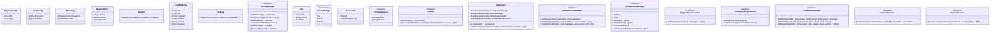

```mermaid
classDiagram
class RegistryConfig {
    + string URL
    + string Type
}
class SinkConfig {
    + []string Directories
    + []string Rulesets
}
class RCConfig {
    + []RegistryConfig Registries
    + []SinkConfig Sinks
}
class ManifestEntry {
    + string Version
    + []string Include
    + []string Exclude
}
class Manifest {
    + map[string]map[string]ManifestEntry Rulesets
}
class LockFileEntry {
    + string URL
    + string Type
    + string Constraint
    + string Resolved
    + []string Include
    + []string Exclude
}
class LockFile {
    + map[string]map[string]LockFileEntry Rulesets
}
class ConfigManager <<interface>> {
    + LoadRCConfig() : RCConfig
    + SaveRCConfig(RCConfig rcConfig)
    + LoadManifest() : Manifest
    + SaveManifest(Manifest manifest)
    + LoadLockFile() : LockFile
    + SaveLockFile(LockFile lockfile)
}

class File {
    + string Path
    + []byte Content
    + int64 Size
}
class VersionRefType <<enumeration>> {
    Tag
    Branch
    Commit
}
class VersionRef {
    + string ID
    + VersionRefType Type
}
class ContentSelector <<interface>> {
    + []string Include
    + []string Exclude
}
class Registry <<interface>> {
    + ListVersions() : []VersionRef
    + GetContent(VersionRef versionRef, ContentSelector selector) : []File
}
class GitRegistry {
    - RulesetCacheManager rulesetCacheManager
    - GitRepositoryManager gitRepoManager
    - RegistryKeyGenerator registryKeyGenerator
    - GitRegistryKeyGenerator gitRegistryKeyGenerator
    + ListVersions() : []VersionRef
    + GetContent(VersionRef versionRef, ContentSelector selector) : []File
}
class RulesetCacheManager <<interface>> {
    + ListVersions(string registryKey, string rulesetKey)
    + Get(string registryKey, string rulesetKey, string version) : []File
    + Set(string registryKey, string rulesetKey, string version, []File files)
}
class GitRepositoryManager <<interface>> {
    + Fetch()
    + Pull()
    + GetTags() : []string
    + GetBranches() : []string
    + Checkout(string ref)
    + GetFiles(ContentSelector selector) : []File
}
class RegistryKeyGenerator <<interface>> {
    + GetRegistryKey(string url, string type): string
}
class GitRegistryKeyGenerator <<interface>> {
    + GetRepositoryKey(string url)
    + GetRulesetKey(ContentSelector selector)
}
class InstallationManager <<interface>> {
    + Install(string sinkDir, string registry, string ruleset, string version, []File files)
    + Uninstall(string sinkDir, string registry, string ruleset, string version)
    + ListFiles(string sinkDir, string registry, string ruleset, string version) : []string
}

class VersionResolver <<interface>> {
    ResolveVersion(constraint string, available []VersionRef) : VersionRef
}
class ContentResolver <<interface>> {
    ResolveContent(selector ContentSelector, available []File) : []File
}

```
